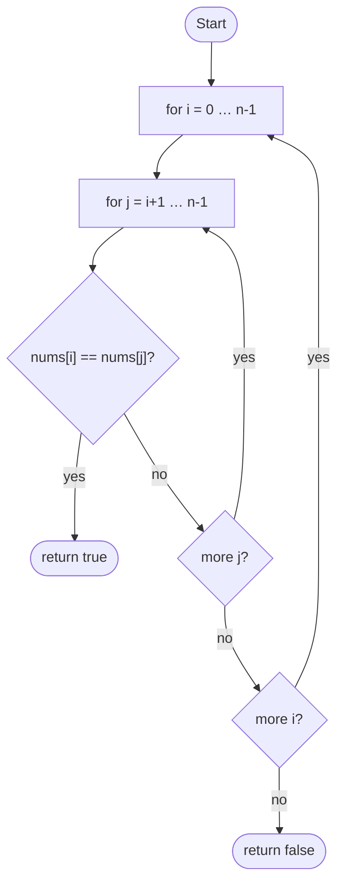

# Brute Force · Flowchart — Contains Duplicate

> Mirrors `1-Brute-Force.c++` · Mermaid (GitHub-rendered) · maintained by Cursor AI

```mermaid
flowchart TD
  Start([Start]) --> LoopI["for i = 0 … n-1"]
  LoopI --> LoopJ["for j = i+1 … n-1"]
  LoopJ --> Cmp{"nums[i] == nums[j]?"}
  Cmp -->|yes| True([return true])
  Cmp -->|no| MoreJ{"more j?"}
  MoreJ -->|yes| LoopJ
  MoreJ -->|no| MoreI{"more i?"}
  MoreI -->|yes| LoopI
  MoreI -->|no| False([return false])
```

**Time / space (from the C++ comments):** O(n²) / O(1)
