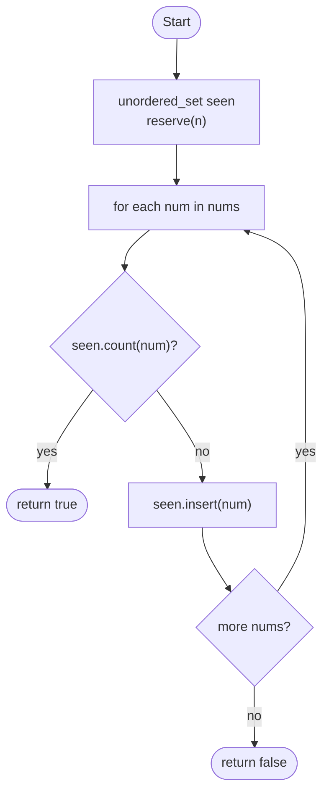

# Optimal · Flowchart — Contains Duplicate

> Mirrors `3-Optimal.c++` · Mermaid (GitHub-rendered) · maintained by Cursor AI

```mermaid
flowchart TD
  Start([Start]) --> Init["unordered_set seen\nreserve(n)"]
  Init --> Loop["for each num in nums"]
  Loop --> Hit{"seen.count(num)?"}
  Hit -->|yes| True([return true])
  Hit -->|no| Ins["seen.insert(num)"]
  Ins --> More{"more nums?"}
  More -->|yes| Loop
  More -->|no| False([return false])
```

**Time / space (from the C++ comments):** O(n) average / O(n)
