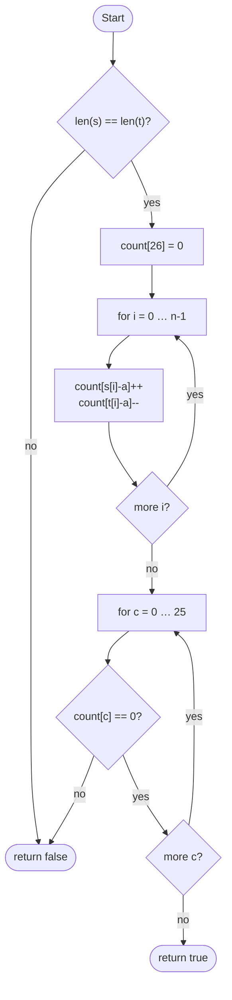

# Optimal · Flowchart — Valid Anagram

> Mirrors `3-Optimal.c++` · Mermaid (GitHub-rendered) · maintained by Cursor AI

```mermaid
flowchart TD
  Start([Start]) --> Len{"len(s) == len(t)?"}
  Len -->|no| False([return false])
  Len -->|yes| Init["count[26] = 0"]
  Init --> Loop["for i = 0 … n-1"]
  Loop --> Inc["count[s[i]-a]++\ncount[t[i]-a]--"]
  Inc --> More{"more i?"}
  More -->|yes| Loop
  More -->|no| Check["for c = 0 … 25"]
  Check --> Zero{"count[c] == 0?"}
  Zero -->|no| False
  Zero -->|yes| MoreC{"more c?"}
  MoreC -->|yes| Check
  MoreC -->|no| True([return true])
```

**Time / space (from the C++ comments):** O(n) / O(1)
