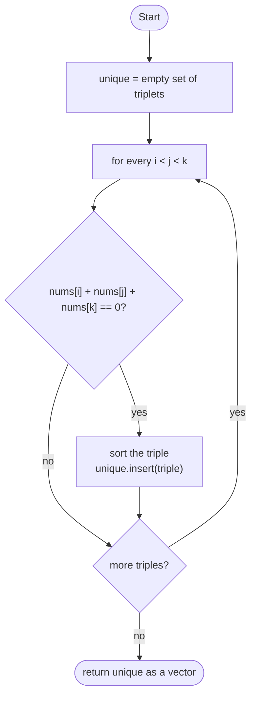

# Brute Force · Flowchart — 3Sum

> Mirrors `1-Brute-Force.c++` · Mermaid (GitHub-rendered) · AI-authored reference

```mermaid
flowchart TD
  Start([Start]) --> Init["unique = empty set of triplets"]
  Init --> Loops["for every i < j < k"]
  Loops --> Zero{"nums[i] + nums[j] + nums[k] == 0?"}
  Zero -->|yes| Add["sort the triple<br/>unique.insert(triple)"]
  Zero -->|no| More{"more triples?"}
  Add --> More
  More -->|yes| Loops
  More -->|no| Done([return unique as a vector])
```

**Time / space (from the C++ comments):** O(n³ log n) / O(t)
