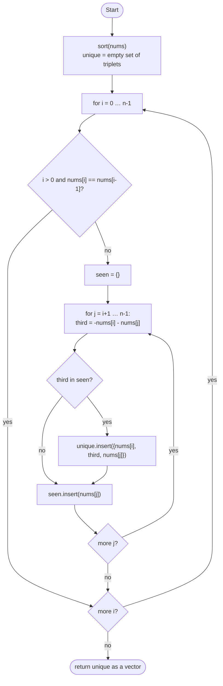

# Optimized · Flowchart — 3Sum

> Mirrors `2-Optimized.c++` · Mermaid (GitHub-rendered) · AI-authored reference

```mermaid
flowchart TD
  Start([Start]) --> Sort["sort(nums)<br/>unique = empty set of triplets"]
  Sort --> LoopI["for i = 0 … n-1"]
  LoopI --> DupI{"i > 0 and nums[i] == nums[i-1]?"}
  DupI -->|yes| MoreI{"more i?"}
  DupI -->|no| Seen["seen = {}"]
  Seen --> LoopJ["for j = i+1 … n-1:<br/>third = -nums[i] - nums[j]"]
  LoopJ --> Has{"third in seen?"}
  Has -->|yes| Add["unique.insert({nums[i], third, nums[j]})"]
  Has -->|no| Ins["seen.insert(nums[j])"]
  Add --> Ins
  Ins --> MoreJ{"more j?"}
  MoreJ -->|yes| LoopJ
  MoreJ -->|no| MoreI
  MoreI -->|yes| LoopI
  MoreI -->|no| Done([return unique as a vector])
```

**Time / space (from the C++ comments):** O(n² log n) / O(n + t)
