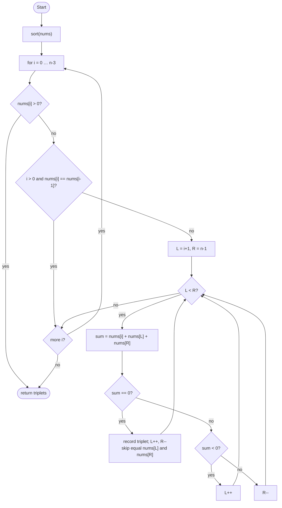

# Optimal · Flowchart — 3Sum

> Mirrors `3-Optimal.c++` · Mermaid (GitHub-rendered) · AI-authored reference

```mermaid
flowchart TD
  Start([Start]) --> Sort["sort(nums)"]
  Sort --> LoopI["for i = 0 … n-3"]
  LoopI --> Pos{"nums[i] > 0?"}
  Pos -->|yes| Done([return triplets])
  Pos -->|no| DupI{"i > 0 and nums[i] == nums[i-1]?"}
  DupI -->|yes| MoreI{"more i?"}
  DupI -->|no| Init["L = i+1, R = n-1"]
  Init --> While{"L < R?"}
  While -->|no| MoreI
  While -->|yes| Sum["sum = nums[i] + nums[L] + nums[R]"]
  Sum --> Hit{"sum == 0?"}
  Hit -->|yes| Rec["record triplet; L++, R--<br/>skip equal nums[L] and nums[R]"]
  Hit -->|no| Neg{"sum < 0?"}
  Neg -->|yes| IncL["L++"]
  Neg -->|no| DecR["R--"]
  Rec --> While
  IncL --> While
  DecR --> While
  MoreI -->|yes| LoopI
  MoreI -->|no| Done
```

**Time / space (from the C++ comments):** O(n²) / O(1) extra besides output
