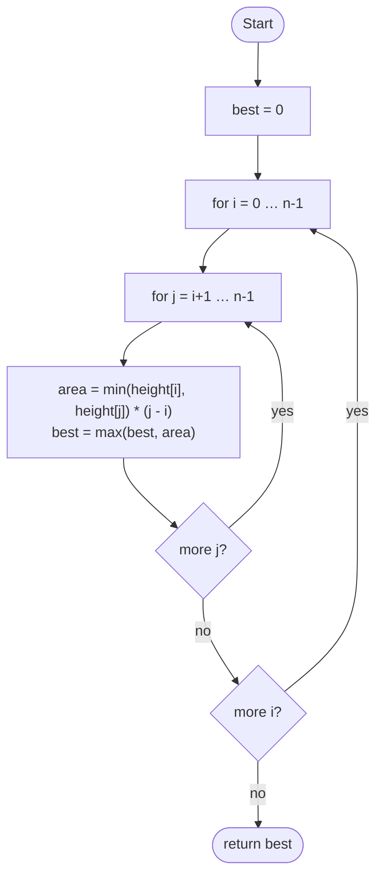

# Brute Force · Flowchart — Container With Most Water

> Mirrors `1-Brute-Force.c++` · Mermaid (GitHub-rendered) · AI-authored reference

```mermaid
flowchart TD
  Start([Start]) --> Init["best = 0"]
  Init --> LoopI["for i = 0 … n-1"]
  LoopI --> LoopJ["for j = i+1 … n-1"]
  LoopJ --> Area["area = min(height[i], height[j]) * (j - i)<br/>best = max(best, area)"]
  Area --> MoreJ{"more j?"}
  MoreJ -->|yes| LoopJ
  MoreJ -->|no| MoreI{"more i?"}
  MoreI -->|yes| LoopI
  MoreI -->|no| Done([return best])
```

**Time / space (from the C++ comments):** O(n²) / O(1)
