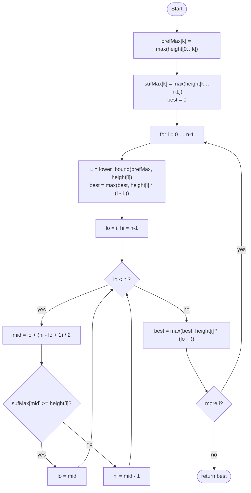

# Optimized · Flowchart — Container With Most Water

> Mirrors `2-Optimized.c++` · Mermaid (GitHub-rendered) · AI-authored reference

```mermaid
flowchart TD
  Start([Start]) --> Pref["prefMax[k] = max(height[0…k])"]
  Pref --> Suf["sufMax[k] = max(height[k…n-1])<br/>best = 0"]
  Suf --> Loop["for i = 0 … n-1"]
  Loop --> Left["L = lower_bound(prefMax, height[i])<br/>best = max(best, height[i] * (i - L))"]
  Left --> Init["lo = i, hi = n-1"]
  Init --> Search{"lo < hi?"}
  Search -->|yes| Mid["mid = lo + (hi - lo + 1) / 2"]
  Mid --> Reach{"sufMax[mid] >= height[i]?"}
  Reach -->|yes| Up["lo = mid"]
  Reach -->|no| Down["hi = mid - 1"]
  Up --> Search
  Down --> Search
  Search -->|no| Right["best = max(best, height[i] * (lo - i))"]
  Right --> More{"more i?"}
  More -->|yes| Loop
  More -->|no| Done([return best])
```

**Time / space (from the C++ comments):** O(n log n) / O(n)
