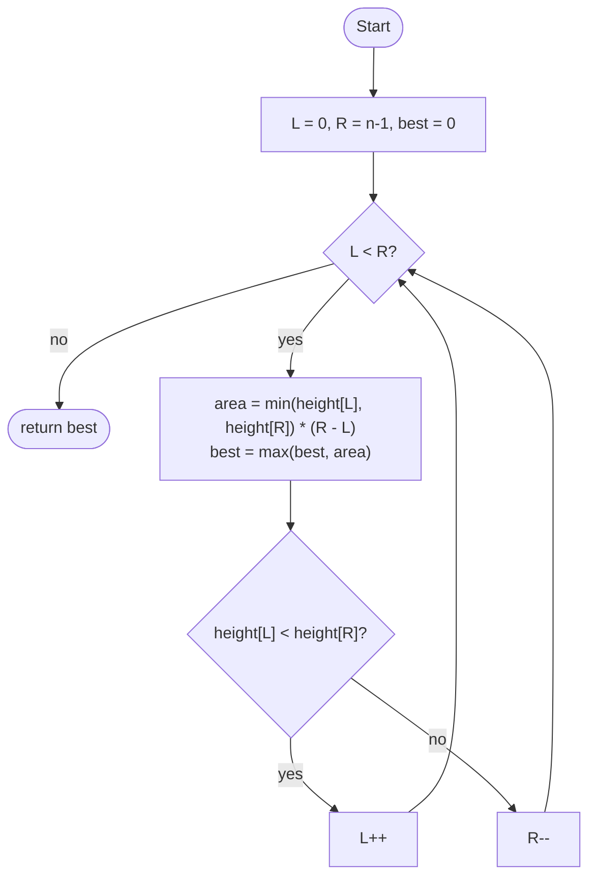

# Optimal · Flowchart — Container With Most Water

> Mirrors `3-Optimal.c++` · Mermaid (GitHub-rendered) · AI-authored reference

```mermaid
flowchart TD
  Start([Start]) --> Init["L = 0, R = n-1, best = 0"]
  Init --> Loop{"L < R?"}
  Loop -->|no| Done([return best])
  Loop -->|yes| Area["area = min(height[L], height[R]) * (R - L)<br/>best = max(best, area)"]
  Area --> Shorter{"height[L] < height[R]?"}
  Shorter -->|yes| IncL["L++"]
  Shorter -->|no| DecR["R--"]
  IncL --> Loop
  DecR --> Loop
```

**Time / space (from the C++ comments):** O(n) / O(1)
